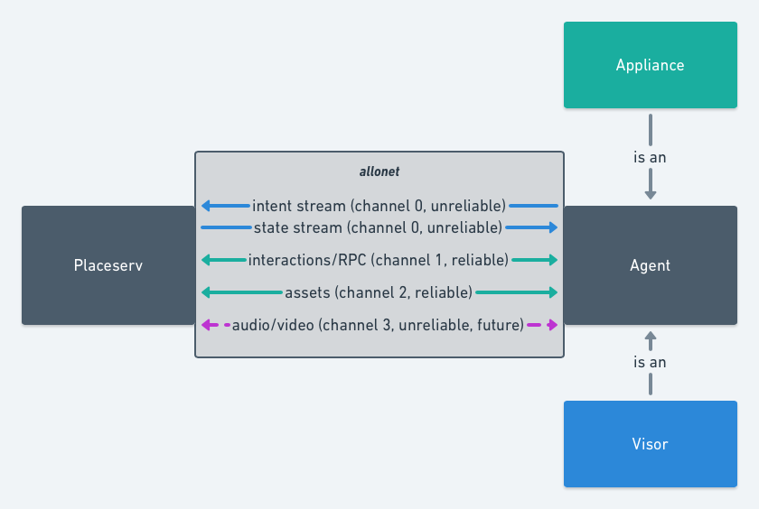
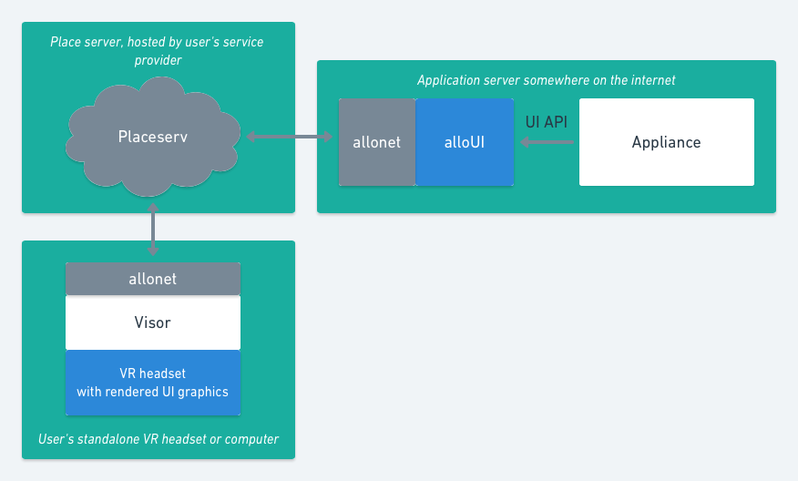

# Alloverse architecture

## Basic premises

* Your "place" is where you decorate, run apps, invite people, and
  hang out. It's like a collaborative X11 server: It runs a world simulation
  server, a voip gateway, and all the backing data for 3d UIs for
  the running apps.
* A "visor" is the GUI application you use to visit places and interact
  with your apps.
* An "appliance" is a process running on your computer, or on a computer
  on the Internet. Like opening a web page (or launching a remote X11
  process), this app can then show its interface and be interacted with
  inside your place. 

A place, a user/visor and appliances are all actors using the same network
protocol and RPC mechanics, implemented in the `allonet` library.

Streams:

* The "state stream" sends the place's representation once every
  server heartbeat. Right now, it sends the entire state, but the plan is
  to send only a diff from the last-acknowledged-state for each client. It's
  a JSON object of Entities and their properties.
* The "intent stream" sends the client or appliance's movement intents and
  related data on every heartbeat. It's a JSON object with relative movement
  intents and absolute orientation requests; details on controller position,
  orientation and state; and an ack of the last successfully received state.
* Interactions are JSON lists, with a sender entity and receiver entity.
* Media streams are undefined now, but will allow texture sharing (for screen
  sharing and advanced 2d applications) and voice chat.

The plan is to use WebRTC as the base transport for free TLS, ICE,
audio/texture sharing, and data channels with both reliable and unreliable
transport. However, since there is no good open source implementation,
allonet is currently using `enet` to provide unreliable and reliable network
channels, and thus audio/video features are postponed.

## Entities and the place state

Right now, entities have an id, position and orientation. The idea is to 
[make them component-based](https://github.com/alloverse/allonet/issues/4),
and then [document known components in this repo](../specifications), but allow
appliances and visors to invent their own components and interactions.

## Interactions and access control

Interactions are the way entities can communicate, including how the visor
talks to the room itself (by setting the destination to NULL/emptystring).
It's a json list for now, and the idea is for it to be a pub-sub
request-response protocol vaguley inspired by [Peter J Robinson et al's
Pedro protocol](http://www.doc.ic.ac.uk/~klc/pedro.pdf).

The placeserv becomes the Pedro gateway, and can thus manage access control lists,
defined as guard expressions on the expression itself, the sender and the receiver.
See [the implementation task](https://github.com/alloverse/allo-placeserv/issues/2)
for more information.

These ACLs can then control everything needed:

* An ACL on the "announce" packet allows place owners to restrict access to
  specific users
* An ACL on the "spawn" packet allows place owners to permit only specific
  users and appliances to manifest in the place
* An ACL on the "acl-modify" packet allows place owners to restrict access
  to the ACL itself to moderators/owners only.

This should be exposed in the visor as much more user friendly than the
bullet list above makes it seem...

## The three components

### Placeserv

The placeserv holds all the state and takes care of all the logic. It is the webrtc hub (eventually) and RPC comms hub. It

* runs a game loop, with physics simulation, intent interpretation, etc.
* pulses diffs to any actors that want it (primarily visors),
* is RPC router between actors (place, visors and apps), including app<>app
* does ACL permission checks on all RPC
* simulates the physical bodies in the room
* Manages at least one physical+visual body for each actor,
* Allows actors to create additional entities

### Visor

I'd love to support different visors: VR, AR desktop 3D and touch. For now,
the focus is on the VR visor in Unity.

`alloverse-place://(https endpoint)...` URLs can be opened to make a visor
open a place ([when that's implemented](https://github.com/alloverse/allovisor/issues/1)).

A visor should provide some sort of client identity. The idea for now is for
each client to provide a public certificate with a name bound to it, so you
can at least know when the same client appears again. Would love an architecture
idea for a distributed identity plan (web of trust?).

### Appliances

Appliances are written in any language and interact with the `allonet` library
acting as a "UIKit" for XR UI.

While appliances can use the allonet API directly, it uses low-level primitives
that are not great for building 3D UIs. The plan is to create an "Allo UI" UI kit
API on top of allonet that spawns entities, shares textures etc as necessary
to provide the [UX and UI interactions that Alloverse standardizes on](../ux),
providing an intuitive and uniform experience across appliances without every
application developer having to think of their own interaction patterns.

If a user opens an `alloappliance+http(s)://...`, it should be opened by the visor.
The visor should then send an interaction to the placeserv, asking it to spawn the
given appliance.

The placeserv should then make the http(s) call to the given URL with a
connection instruction json blob:

    { 
      "url": "alloplace://hostname:port",
      "onBehalfOf": (client identity),
      "query": (query params as-is from the alloappliance url) 
    }.

The http server receiving this request should then spawn a process for this
agent and have it connect to the given room. See [the implementation task
for opening appliances with
URLs](https://github.com/alloverse/allo-placeserv/issues/8).

## Assets

Entities should have components representing assets such as:

* mesh/model
* textures
* animations
* static sounds

They should reference these assets by sha1 hash. When a placeserv sees a new
hash in the description of an entity coming from an agent, it should ask that
agent for that asset hash over the asset channel. The agent should then stream
the asset to the server for caching and redelivery.

When another agent then sees the references to the assets, it can thus then
ask the placeserv for the corresponding asset, so that it can then later display
it.

Dynamic textures and audio will later be represented as webrtc streams, and thus
not considered assets the same way. Placeserv then acts as an SFU.
