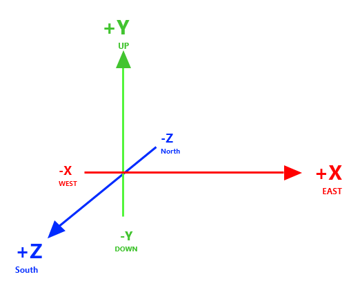

# Coordinate systems in Alloverse

The coordinate system in Alloverse has the following properties:

1. One unit is 1 meter
2. Coordinate system is [right-handed](https://www.evl.uic.edu/ralph/508S98/coordinates.html). This implies...
3. Negative X is left/west, positive X is right/east.
4. Negative Y is down, positive Y is up.
5. Negative Z is forward/north, positive Z is back/south.
6. Positive rotation is counterclockwise about the axis of rotation.
7. Rotations are always represented in radians.
8. Y=0 is floor level in model space
9. The neutral pose of all models, avatars, app UIs etc should should face towards positive Z, with "right" being positive X and "up" being positive Y.
11. For textures, UV 0,0 is bottom-left, with positive U towards the right, and positive V upwards.
12. The origin of an entity should be in its middle. 

## Representation

Transforms are always represented using a 16-element transformation matrix. Such a 4x4 matrix is
represented in data models with a column-major 16-element list of numbers.
